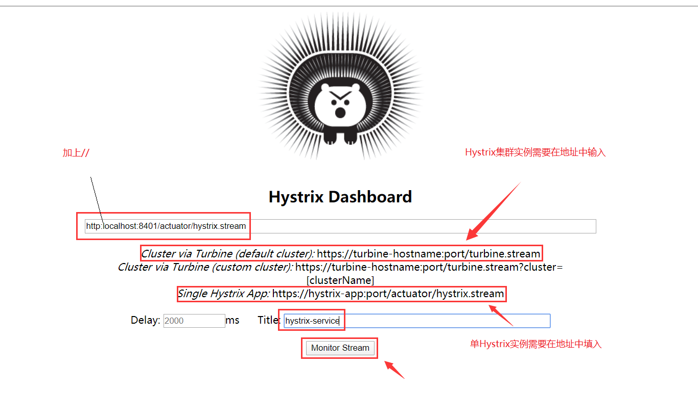
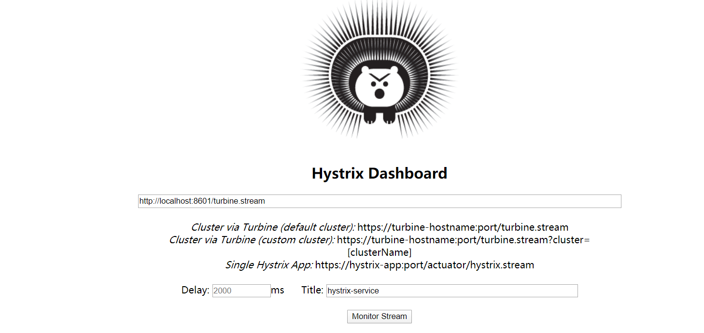

# 项目结构

```yaml
springcloud-learning
├── eureka-server -- eureka注册中心
├── eureka-security-server -- 带登录认证的eureka注册中心
├── eureka-client -- eureka客户端
├── user-service -- 提供User对象CRUD接口的服务
├── ribbon-service -- ribbon服务调用测试服务
├── hystrix-service -- hystrix服务调用测试服务
├── turbine-service -- 聚合收集hystrix实例监控信息的服务
├── hystrix-dashboard -- 展示hystrix实例监控信息的仪表盘
├── feign-service -- feign服务调用测试服务
├── zuul-proxy -- zuul作为网关的测试服务
├── config-server -- 配置中心服务
├── config-client -- 获取配置的客户端服务
├── admin-server -- admin监控中心服务
├── admin-client -- admin监控中心监控的应用服务
├── oauth2-server -- oauth2认证测试服务
├── oauth2-jwt-server -- 使用jwt的oauth2认证测试服务
├── oauth2-client -- 单点登录的oauth2客户端服务
```
# Eureka的常用配置

```yaml
eureka:
  client: #eureka客户端配置
    register-with-eureka: true #是否将自己注册到eureka服务端上去
    fetch-registry: true #是否获取eureka服务端上注册的服务列表
    service-url:
      defaultZone: http://localhost:8001/eureka/ # 指定注册中心地址
    enabled: true # 启用eureka客户端
    registry-fetch-interval-seconds: 30 #定义去eureka服务端获取服务列表的时间间隔
  instance: #eureka客户端实例配置
    lease-renewal-interval-in-seconds: 30 #定义服务多久去注册中心续约
    lease-expiration-duration-in-seconds: 90 #定义服务多久不去续约认为服务失效
    metadata-map:
      zone: jiangsu #所在区域
    hostname: localhost #服务主机名称
    prefer-ip-address: false #是否优先使用ip来作为主机名
  server: #eureka服务端配置
    enable-self-preservation: false #关闭eureka服务端的保护机制
```
# RestTemplate的使用

```text
RestTemplate是一个HTTP客户端，使用它我们可以方便的调用HTTP接口，支持GET、POST、PUT、DELETE等方法。
```
#### GET请求方法

```java
<T> T getForObject(String url, Class<T> responseType, Object... uriVariables);

<T> T getForObject(String url, Class<T> responseType, Map<String, ?> uriVariables);

<T> T getForObject(URI url, Class<T> responseType);

<T> ResponseEntity<T> getForEntity(String url, Class<T> responseType, Object... uriVariables);

<T> ResponseEntity<T> getForEntity(String url, Class<T> responseType, Map<String, ?> uriVariables);

<T> ResponseEntity<T> getForEntity(URI var1, Class<T> responseType);

```
- getForObject方法示例
```java
@GetMapping("/{id}")
public CommonResult getUser(@PathVariable Long id) {
    return restTemplate.getForObject(userServiceUrl + "/user/{1}", CommonResult.class, id);
}
```
- getForEntity方法示例
```java
@GetMapping("/getEntityByUsername")
public CommonResult getEntityByUsername(@RequestParam String username) {
    ResponseEntity<CommonResult> entity = restTemplate.getForEntity(userServiceUrl + "/user/getByUsername?username={1}", CommonResult.class, username);
    if (entity.getStatusCode().is2xxSuccessful()) {
        return entity.getBody();
    } else {
        return new CommonResult("操作失败", 500);
    }
}
```
#### POST请求方法

```java
<T> T postForObject(String url, @Nullable Object request, Class<T> responseType, Object... uriVariables);

<T> T postForObject(String url, @Nullable Object request, Class<T> responseType, Map<String, ?> uriVariables);

<T> T postForObject(URI url, @Nullable Object request, Class<T> responseType);

<T> ResponseEntity<T> postForEntity(String url, @Nullable Object request, Class<T> responseType, Object... uriVariables);

<T> ResponseEntity<T> postForEntity(String url, @Nullable Object request, Class<T> responseType, Map<String, ?> uriVariables);

<T> ResponseEntity<T> postForEntity(URI url, @Nullable Object request, Class<T> responseType);

```
- postForObject示例
```java
@PostMapping("/create")
public CommonResult create(@RequestBody User user) {
    return restTemplate.postForObject(userServiceUrl + "/user/create", user, CommonResult.class);
}
```
- postForEntity示例
```java
@PostMapping("/create")
public CommonResult create(@RequestBody User user) {
    return restTemplate.postForEntity(userServiceUrl + "/user/create", user, CommonResult.class).getBody();
}
```
#### PUT请求方法

```java
void put(String url, @Nullable Object request, Object... uriVariables);

void put(String url, @Nullable Object request, Map<String, ?> uriVariables);

void put(URI url, @Nullable Object request);

```
- PUT请求示例
```java
@PutMapping("/update")
public CommonResult update(@RequestBody User user) {
    restTemplate.put(userServiceUrl + "/user/update", user);
    return new CommonResult("操作成功",200);
}

```
#### DELETE请求方法

```java
void delete(String url, Object... uriVariables);

void delete(String url, Map<String, ?> uriVariables);

void delete(URI url);


```
- DELETE请求示例
```java
@DeleteMapping("/delete/{id}")
public CommonResult delete(@PathVariable Long id) {
   restTemplate.delete(userServiceUrl + "/user/delete/{1}", null, id);
   return new CommonResult("操作成功",200);
}

```
# Ribbon的常用配置

```yaml
ribbon:
  ConnectTimeout: 1000 #服务请求连接超时时间（毫秒）
  ReadTimeout: 3000 #服务请求处理超时时间（毫秒）
  OkToRetryOnAllOperations: true #对超时请求启用重试机制
  MaxAutoRetriesNextServer: 1 #切换重试实例的最大个数
  MaxAutoRetries: 1 # 切换实例后重试最大次数
  NFLoadBalancerRuleClassName: com.netflix.loadbalancer.RandomRule #修改负载均衡算法

```
#### 指定服务进行配置

```yaml
user-service:
  ribbon:
    ConnectTimeout: 1000 #服务请求连接超时时间（毫秒）
    ReadTimeout: 3000 #服务请求处理超时时间（毫秒）
    OkToRetryOnAllOperations: true #对超时请求启用重试机制
    MaxAutoRetriesNextServer: 1 #切换重试实例的最大个数
    MaxAutoRetries: 1 # 切换实例后重试最大次数
    NFLoadBalancerRuleClassName: com.netflix.loadbalancer.RandomRule #修改负载均衡算法

```
# Ribbon的负载均衡策略

```text
所谓的负载均衡策略，就是当A服务调用B服务时，此时B服务有多个实例，这时A服务以何种方式来选择调用的B实例，ribbon可以选择以下几种负载均衡策略
```
- com.netflix.loadbalancer.RandomRule：从提供服务的实例中以随机的方式；
- com.netflix.loadbalancer.RoundRobinRule：以线性轮询的方式，就是维护一个计数器，从提供服务的实例中按顺序选取，第一次选第一个，第二次选第二个，以此类推，到最后一个以后再从头来过；
- com.netflix.loadbalancer.RetryRule：在RoundRobinRule的基础上添加重试机制，即在指定的重试时间内，反复使用线性轮询策略来选择可用实例；
- com.netflix.loadbalancer.WeightedResponseTimeRule：对RoundRobinRule的扩展，响应速度越快的实例选择权重越大，越容易被选择；
- com.netflix.loadbalancer.BestAvailableRule：选择并发较小的实例；
- com.netflix.loadbalancer.AvailabilityFilteringRule：先过滤掉故障实例，再选择并发较小的实例；
- com.netflix.loadbalancer.ZoneAwareLoadBalancer：采用双重过滤，同时过滤不是同一区域的实例和故障实例，选择并发较小的实例。
#Hystrix的常用配置
```yaml
hystrix:
  command: #用于控制HystrixCommand的行为
    default:
      execution:
        isolation:
          strategy: THREAD #控制HystrixCommand的隔离策略，THREAD->线程池隔离策略(默认)，SEMAPHORE->信号量隔离策略
          thread:
            timeoutInMilliseconds: 1000 #配置HystrixCommand执行的超时时间，执行超过该时间会进行服务降级处理
            interruptOnTimeout: true #配置HystrixCommand执行超时的时候是否要中断
            interruptOnCancel: true #配置HystrixCommand执行被取消的时候是否要中断
          timeout:
            enabled: true #配置HystrixCommand的执行是否启用超时时间
          semaphore:
            maxConcurrentRequests: 10 #当使用信号量隔离策略时，用来控制并发量的大小，超过该并发量的请求会被拒绝
      fallback:
        enabled: true #用于控制是否启用服务降级
      circuitBreaker: #用于控制HystrixCircuitBreaker的行为
        enabled: true #用于控制断路器是否跟踪健康状况以及熔断请求
        requestVolumeThreshold: 20 #超过该请求数的请求会被拒绝
        forceOpen: false #强制打开断路器，拒绝所有请求
        forceClosed: false #强制关闭断路器，接收所有请求
      requestCache:
        enabled: true #用于控制是否开启请求缓存
  collapser: #用于控制HystrixCollapser的执行行为
    default:
      maxRequestsInBatch: 100 #控制一次合并请求合并的最大请求数
      timerDelayinMilliseconds: 10 #控制多少毫秒内的请求会被合并成一个
      requestCache:
        enabled: true #控制合并请求是否开启缓存
  threadpool: #用于控制HystrixCommand执行所在线程池的行为
    default:
      coreSize: 10 #线程池的核心线程数
      maximumSize: 10 #线程池的最大线程数，超过该线程数的请求会被拒绝
      maxQueueSize: -1 #用于设置线程池的最大队列大小，-1采用SynchronousQueue，其他正数采用LinkedBlockingQueue
      queueSizeRejectionThreshold: 5 #用于设置线程池队列的拒绝阀值，由于LinkedBlockingQueue不能动态改版大小，使用时需要用该参数来控制线程数
```
#### 实例配置

```yaml
hystrix:
  command:
    HystrixComandKey: #将default换成HystrixComrnandKey
      execution:
        isolation:
          strategy: THREAD
  collapser:
    HystrixCollapserKey: #将default换成HystrixCollapserKey
      maxRequestsInBatch: 100
  threadpool:
    HystrixThreadPoolKey: #将default换成HystrixThreadPoolKey
      coreSize: 10
```
#### 配置文件中相关key的说明

- HystrixComandKey对应@HystrixCommand中的commandKey属性；
- HystrixCollapserKey对应@HystrixCollapser注解中的collapserKey属性；
- HystrixThreadPoolKey对应@HystrixCommand中的threadPoolKey属性。
#Hystrix仪表板：断路器执行监控




# Zuul常用配置

```yaml
zuul:
  routes: #给服务配置路由
    user-service:
      path: /userService/**
    feign-service:
      path: /feignService/**
  ignored-services: user-service,feign-service #关闭默认路由配置
  prefix: /proxy #给网关路由添加前缀
  sensitive-headers: Cookie,Set-Cookie,Authorization #配置过滤敏感的请求头信息，设置为空就不会过滤
  add-host-header: true #设置为true重定向是会添加host请求头
  retryable: true # 关闭重试机制
  PreLogFilter:
    pre:
      disable: false #控制是否启用过滤器

```
#### Ribbon和Hystrix的支持
```text
由于Zuul自动集成了Ribbon和Hystrix，所以Zuul天生就有负载均衡和服务容错能力，我们可以通过Ribbon和Hystrix的配置来配置Zuul中的相应功能。
```
- 可以使用Hystrix的配置来设置路由转发时HystrixCommand的执行超时时间：
```yaml
hystrix:
  command: #用于控制HystrixCommand的行为
    default:
      execution:
        isolation:
          thread:
            timeoutInMilliseconds: 1000 #配置HystrixCommand执行的超时时间，执行超过该时间会进行服务降级处理

```
- 可以使用Ribbon的配置来设置路由转发时请求连接及处理的超时时间：
```yaml
ribbon: #全局配置
  ConnectTimeout: 1000 #服务请求连接超时时间（毫秒）
  ReadTimeout: 3000 #服务请求处理超时时间（毫秒）

```